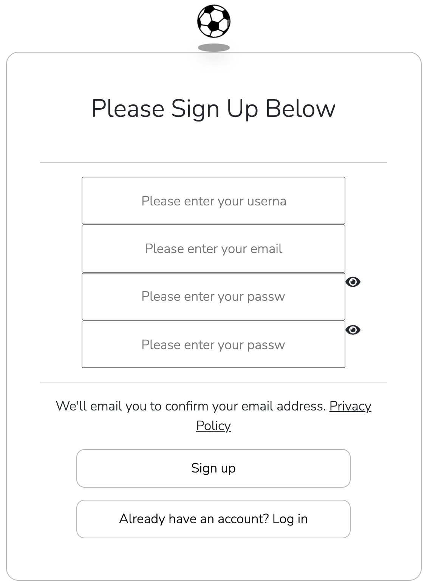
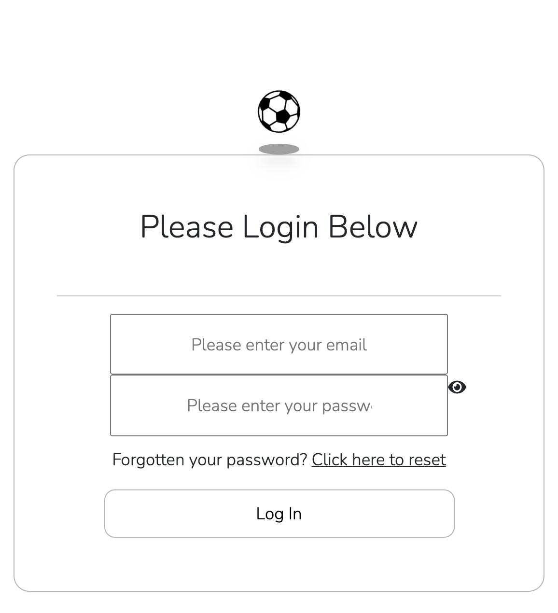
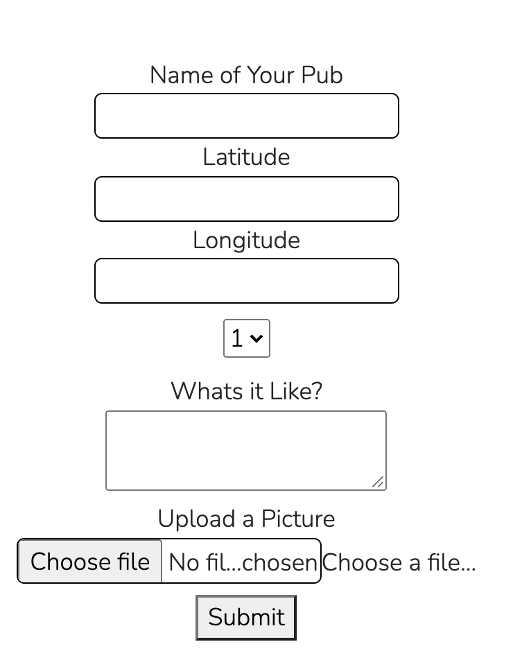
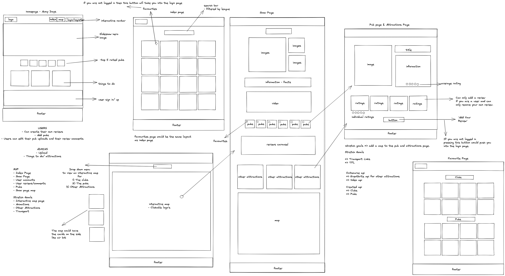
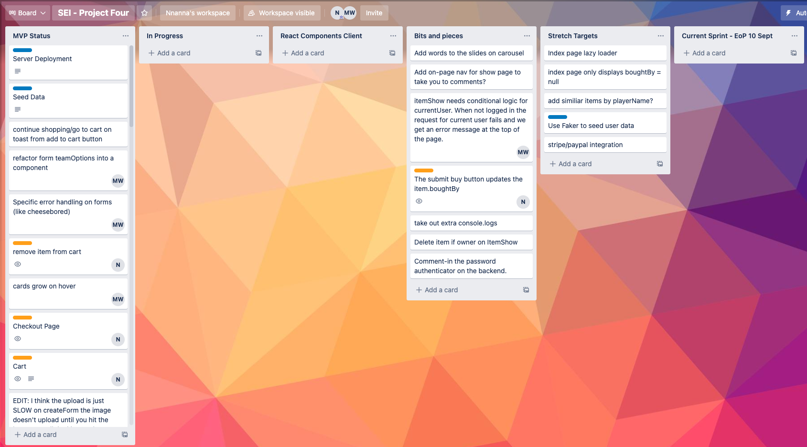
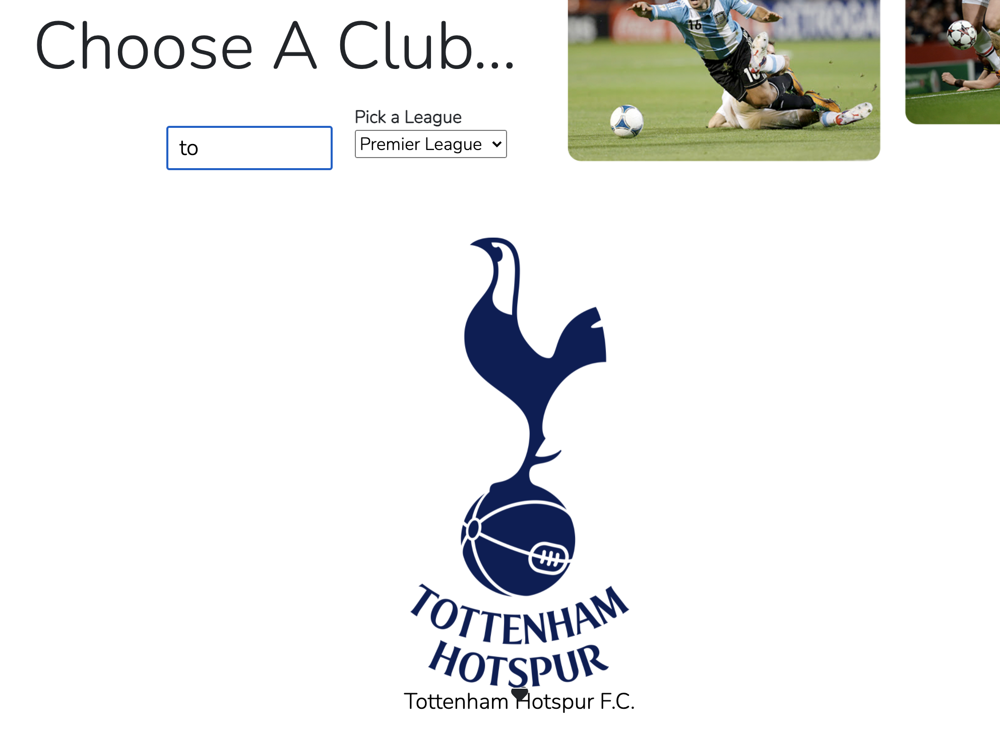

# Away Days

## Overview

Away Days is a football match day app for away supporters to share information about their favourite pubs around football stadiums. The app was built with React on the frontend and Express, Node, and MongoDB on the backend.

## Brief

Our brief for this project was to build a full-stack application making our own:

-   Backend using an Express API to serve our data from a Mongo database.

-   Frontend built with React to consume our API.

The app was also required to be a complete product meaning multiple relationships and CRUD functionality for at least a couple of models.

## Members

[Jessica Strawford](https://github.com/jessicastrawford)

[James Guppy](https://github.com/jguppy92)

[Nnanna Uwakwe](https://github.com/Uwaks)

## Deployment

The live app can be viewed here (link to deployed site)

## Getting started

Access the source code via the 'clone or download' button

`npm install` - Install dependencies

`npm run dev` - Run the app in development mode

## Demonstration/cover image 


## Technologies Used

- HTML
- SCSS
- React
- Node
- Express
- Insomnia
- MongoDB
- Mongoose

## User Journey

**_User registration_**


**User login**


**Creating a pub**


## Process

### Planning Stage

At our initial idea brainstorming session it became apparent early on that James' idea of a matchday app for visiting supporters to browse for information on which pubs to hang out prior to the game was the leading candidate.

We initially toyed with the idea of including other events happening in the same area utilising the Eventbrite API in the MVP as well as an interactive map as the index page, however both were cut as the deadline drew nearer.

Once we had agreed on the candidate idea, we produced detailed wireframes of the app's frontend, highlighting the differing views available for logged in and guest users.



### Project Management

All of our project management tasks were done using a shared Trello board, the first change we had to make was in the distribution of tasks. Initially building the Express API was a joint task, but this was found to be inefficient and prone to errors, so one team member was given the task of building the backend whilst the other two focused on building the seed data and building the front end.



### Build Stage

### _Backend Development_

The API was built in 3 distinct phases and at each stage the endpoints were tested with Insomnia; all group members were able to participate with testing as we took out a trial period with Insomnia's premium tier, so we all shared the same testing environment.

### Club Models

The clubs were at the heart of the app as everything revolves around the matchday experience including the general location of all the pubs.

```javascript
export const clubSchema = new mongoose.Schema({
  clubName: { type: String, required: true },
  league: { type: String, required: true },
  logo: { type: String, required: true },
  mainImage: { type: String, required: true },
  imageTwo: { type: String, required: true },
  imageThree: { type: String, required: true },
  latitude: { type: Number, required: true },
  longitude: { type: Number, required: true },
  location: { type: String, required: true },
  capacity: { type: Number, required: true },
  stadiumInfo: { type: String, required: true },
  addedBy: { type: mongoose.Schema.ObjectId, ref: 'User', required: true },
  likedBy: [{ type: mongoose.Schema.ObjectId, ref: 'User' }],

  pubs: [pubSchema],
})
```

### Pub Models & Comment Models

The pubs represented the main area of user interaction as registered users had the ability to create,edit and delete their own pubs. We also created endpoints for user's to comment on pubs 

```javascript
export const pubSchema = new mongoose.Schema(
  {
    pubName: { type: String, required: true },
    comments: [commentSchema],
    userRating: { type: Number, required: true, min: 1, max: 5 },
    latitude: { type: Number, required: true },
    longitude: { type: Number, required: true },
    description: { type: String, required: true, maxlength: 350 },
    image: { type: String, required: true },
    addedBy: { type: mongoose.Schema.ObjectId, ref: 'User' },
    likedBy: [{ type: mongoose.Schema.ObjectId, ref: 'User' }],
  }
)
```

### User Models 

The user model was more complex as we had to set up secure routes as well as password authentication and hashing methods. Some of the user authentication methods we used to hook into mongoose actions are shown below: 

```javascript
// * Sets up password confirmation
userSchema
  .virtual('passwordConfirmation')
  .set(function(passwordConfirmation) {
    this._passwordConfirmation = passwordConfirmation
  })

// * Compares both passwords when registering
userSchema
  .pre('validate', function(next) {
    if (this.isModified('password') && this.password !== this._passwordConfirmation) {
      this.invalidate('passwordConfirmation', 'does not match')
    }
    next()
  })

// * Hashes password for security
userSchema
  .pre('save', function(next) {
    if (this.isModified('password')) {
      this.password = bcrypt.hashSync(this.password, bcrypt.genSaltSync())
    }
    next()
  })

userSchema.methods.validatePassword = function(password) {
  return bcrypt.compareSync(password, this.password)
}
```

Once the User model was completed and the endpoints tested, we created 100 dummy users with the faker package. We also went a step further utilising the code to randomly generate user comments. 

```javascript
const users = []

    for (let i = 0; i < 100; i++) {
      const username = faker.internet.userName()
      const firstName = faker.name.firstName()
      const lastName = faker.name.lastName()
      const email = `${firstName}.${lastName}@awaydays.com`
      const avatar = faker.image.avatar()
      users.push({
        username,
        email,
        avatar,
        password: 'pass',
        passwordConfirmation: 'pass',
        isAdmin: false,
      })

const createdUsers = await User.create(users)

    console.log(`🤖 Created ${createdUsers.length} Users`)

    clubData.forEach(club => {
      club.addedBy = admin
      const commentText = faker.lorem.sentence()
      const commentRating = Math.ceil(Math.random() * 5)
      club.pubs.map(pub => {
        pub.comments.push({
          text: commentText,
          rating: commentRating,
          addedBy: createdUsers[Math.floor(Math.random() * 100)],
        })
      })
```

### _Data development_

As we wanted to showcase the search functionality on an index page we needed to ensure we had enough clubs represented in the various professional leagues. We decided on 20 clubs and 40 pubs (2 per club) as our sample size for the seed data, we also decided to set a geographical restriction and settled on clubs within the Greater London area. Once the club data was finalised, local pubs around the clubs were then embedded within each club as an array.

```
{
    clubName: 'Tottenham Hotspur F.C.',
    logo: 'https://upload.wikimedia.org/wikipedia/en/thumb/b/b4/Tottenham_Hotspur.svg/1200px-Tottenham_Hotspur.svg.png',
    league: 'Premier League',
    mainImage: 'https://i.guim.co.uk/img/media/0c43389417f433da9cde5604c38fc4e6f8940de2/0_0_4500_3000/master/4500.jpg?width=465&quality=45&auto=format&fit=max&dpr=2&s=0570ad2926dae5cc1c631a58e6b83405',
    imageTwo: 'https://e0.365dm.com/19/03/2048x1152/skysports-tottenham-hotspur_4618712.jpg',
    imageThree: 'https://www.football-stadiums.co.uk/images/tottenham-stadium/c.jpg',
    latitude: 51.6043,
    longitude: -0.0678,
    location: 'Tottenham, London',
    capacity: 62850,
    stadiumInfo: 'The Tottenham Hotspur Stadium is the home of Premier League club Tottenham Hotspur in north London, replacing the club\'s previous stadium, White Hart Lane. With a seating capacity of 62,850, it is the third-largest football stadium in England and the largest club stadium in London',

    pubs: [
      {
        pubName: 'The Bricklayer\'s Arms',
        comments: [],
        userRating: 5,
        latitude: 51.6060,
        longitude: -0.0684,
        description: 'The Bricklayer\'s Arms is an excellent little pub that has a huge beer garden, shows pretty much all sports on large screens and is really close to Tottenham Hotspur Stadium.',
        image: 'https://tottenham-hotspur-stadium.com/images/image14.jpg',
      },
      {
        pubName: 'The Bill Nicholson Pub',
        comments: [],
        userRating: 4,
        latitude: 51.6057,
        longitude: -0.0616,
        description: 'Shows all home and away games.',
        image: 'https://whatpub-new.s3.eu-west-1.amazonaws.com/images/pubs/800x600%402x/NLD-5814-36881-bill-nicholson-tottenham.jpg',
      }
    ],
  }
  ```

### _Frontend Development_

The first thing we did on the frontend was to create the static React components: Home, Navbar, ClubIndex (club archive), ClubShow (single club), PubShow, Footer, Register, Login and PubForm (create pub). Prior to the backend being finalised we set up dummy files to build out the club and pub pages and once it was live we set up the logic to make calls to the backend.

The ClubIndex component displayed all the clubs in the database and contained the logic to show views filtered by league or by entering the club name in the search bar.



The PubForm component logic proved to be particularly complicated to set up as one of the required fields was an image of the pub. This was achieved using cloudinary, a web app which provides an api for digital media management. It also required passing data from a child component to it's parent, something I hadn't done before. I created an image uploader component with all the required logic and passed it an image upload function as a prop from the PubForm component. When the function was invoked (onChange event) it sent the data (url from cloudinary) up to the PubForm, where it is then submitted as part of the form data. 

```javascript
function ImageUploadField({ onChange, labelText, name, value }) {
  const [isUploading, setIsUploading] = React.useState(false)

  const handleUpload = async event => {
    setIsUploading(true)
    const data = new FormData()
    data.append('file', event.target.files[0])
    data.append('upload_preset', uploadPreset)
    const res = await axios.post(uploadUrl, data)
    onChange(res.data.url, name)
    setIsUploading(false)
  }
```

I used the ReactMapGL component to produce a static map on the ClubShow page, which used the gps coordinates entered in the club seed data user to highlight the location of the stadium.

```javascript
<div className="map-container">
  <ReactMapGL
    mapboxApiAccessToken={process.env.REACT_APP_MAPBOX_ACCESS_TOKEN}
    height="100%"
    width="100%"
    mapStyle="mapbox://styles/mapbox/streets-v11"
    latitude={latitude}
    longitude={longitude}
    zoom={15}
    />
</div>
```

## Challenges

Our major challenge was the complexity of the data models we built, from the outset we had an idea of how we wanted the relationships to work, however accessing the data on the frontend proved very tricky.

Each pub was an embedded document within the Club schema and each comment was an embedded document within the Pub schema so accessing this data on the frontend required running a map method on mapped data and a great deal of head scratching when React informed us that, '..this is not a function'

Using GitHub proved to be a real challenge and was fundamental in changing how we worked as a team. We had to ensure we communicated effectively before pushing changes to the development branch, we also had to ensure that we left informative messages within the Git commits we each had to make.

## Wins

A major win from this project was working in a team within a software development setting as I was able to:

-   Share/contribute code via a GitHub repository further consolidating my understanding of the application.

-   Enhance my technical communication skills as I was required to communicate code changes and merges, resolve merge conflicts etc.

## Future improvements

-   Completing the user comments functionality.

-   For a better UX, implementing a postcode to gps coordinates refactor with Geocode.xyz or Google Geocoding API.

-   Adding interactivity to all maps and constructing an interactive map index page, this was probably a missed opportunity.

-   Other nearby events/attractions consuming the Eventbrite API would also add some value.

-   Adding the Display ratings and likes functionality.

## Key learnings

As this was my first full stack application build I was exposed to so many learning opportunities, chief among these were:

-   Developing my understanding of how RESTful routes and user authentication work on both the front and back ends. 

-   Using 3rd-party React packages such as ReactMapGL opened up a whole new raft of opportunities.

-   I learned a lot from my teammates, as well as how to work efficiently in a group using Git as a version control tool and GitHub as a remote repository.
